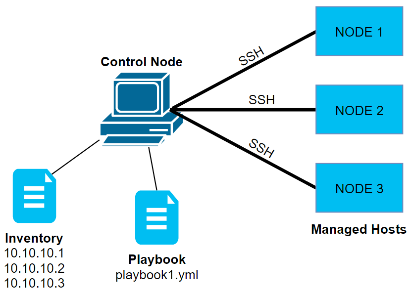

## What is Ansible

Ansible is an automation tool to manage configuration of the servers. It can configure systems, deploy software, and orchestrate more advanced IT tasks such as continuous deployments or zero downtime rolling updates. Ansible known as Configuration managment tool. There are other configuration management tool like chef, puppet but ansible is more preferable.

### Basic conecpts / terminologies

- Control Node - Server from where you run Ansible Commands/Scripts/playbooks.
- Manage Node - Servers you managed/controlled by Ansible.
- Inventory - A list of managed nodes. 
- Modules - The units of code Ansible executes.
- Tasks - The units of action in Ansible. 
- Playbooks - Ordered lists of tasks, saved so you can run those tasks in that order repeatedly.

**Note** - *You cannot use a Windows machine as a control node.*

### Communication between servers

Ansible works on SSH protocol to communicate with Manage Nodes. Now when we run ansible scripts it runs on remote system on ssh protocol which require authentication.

**Note** - *Although Windows can not be Control Node, but can be Managed Node. Ansible require WinRM serivce in windows to communicate with it.*

There are multiple way to authenticate Control Node with Manage Node.
We can 
- use username and password for authentication.
- setup key based authentication.

### Ansible configuration files

Below are default config files of ansible.

*/etc/ansible/hosts*

*/etc/ansible/ansible.cfg* 

### Preferences of ansible conf files

Although default configuration file we will found in */etc/ansible* but we can put it somewhere else also. Below are preferences for ansible.cfg configuration file.

- **ANSIBLE_CONFIG** (environment variable if set)
- ansible.cfg (in the **current directory**)
- ~/.ansible.cfg (in the **home directory**)
- /etc/ansible/ansible.cfg

**Note** - *Ansible will not automatically load a config file from the current working directory **if the ansible.cfg file is world-writable**.*

### Format of host file

There are 2 format available in which we can maintain host file.

- ini file format. Refer [hosts](./hosts)   
- yaml/yml file format. Refer [hosts.yaml](./hosts.yaml)

**Note** - *There is no need to give .ini extension to ini file.*

------

Back to [LearnANSIBLE](../Readme.md)

Go to [Lab-2](../Lab-2/Readme.md)
