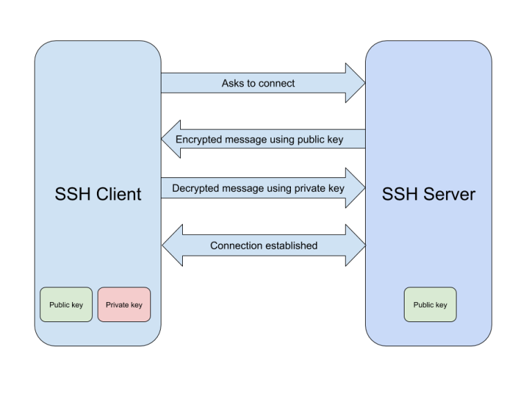

### Setup Ansible repo for very first time

- Create repo called **infra-config** and clone on your system.
- Create **ansible** directory inside infra-config.
- Create **ansible.cfg** file inside **ansible** directory. Refer [ansible.cfg](./Lab/ansible.cfg)
- Create **hosts** file. Refer [hosts](./Lab/hosts)
- Commit and push changes to reposiory.

Now onwards we can clone this repo on any system and execute ansible playbooks. There is no need of special system. But in real world, we do have special system from where we run ansible playbooks and the reason is security.

Through ansible, we manage server's configuration, application deployments etc. For this we require a server which is allowed for SSH on Managed Nodes. Now in real world we have multiple environment(dev,qa,dr,prod), with multiple type of networks (public/private), so although we can run ansible script from any server but it is not feasible in real world.

In real world, we have special system which have special privilege, role, permission so that it can connect to any server for automation purpose. 

During this course, we will clone above repo in our local system as well as on Control Node. We will write code in visual studio code and will push to repo. On Control node will pull changes which we have made, and then will run ansible script.

### Basic server setup

Let's create Control Node and Managed Node using ***[ansible-userdata.sh](../../userdata-scripts/ansible-userdata.sh)*** userdata script.

We have done below things in userdata script.
- Enable password login. By default it is disable in cloud system.
- User *ansible* created
- Generate ssh key for ansible user.
- Given sudo access to ansible user. (only required in Manage node, but we have given in both)
- Created *admin* user and given sudo access. (optional)
- Install *git* package
- Install *ansible* package.

Now only one thing is pending that is establish password less login between Control Node and Manage Node.

To understand how password less login works, below image will help.

Let's do this for our convenience. We will call Ansible Server for Control Node and *Webserver* for Manage Node because we are installing apache webserver in that.

Login on Ansible Server with *ansible* user and execute below command.

    ssh-copy-id ansible@<IP-of-WEBSERVER>

Now let's test connection. Execute below command from Ansible server

    ssh ansible@<IP-of-WEBSERVER> 'hostname'

Above command should print hostname of *WEBSERVER* which is another system (Manage Node).

## Setup server in ansible

In ansible whenever any new system you need to manage/control, you need to first add it's detail to host file and test connectivity.

- Go to infra-config/ansible in ansible repo.
- Make entry in host file as below

        webserver   ansible_user=ansible ansible_host=IP-ADDRESS

- Test connectivity

        ansible -m ping webserver

If above command run successfully, you are done. But it gives some error then need to troubleshoot.

------

Back to [LearnANSIBLE](../Readme.md)

Go to [Lab-3](../Lab-3/Readme.md)