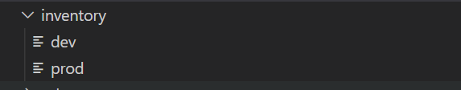
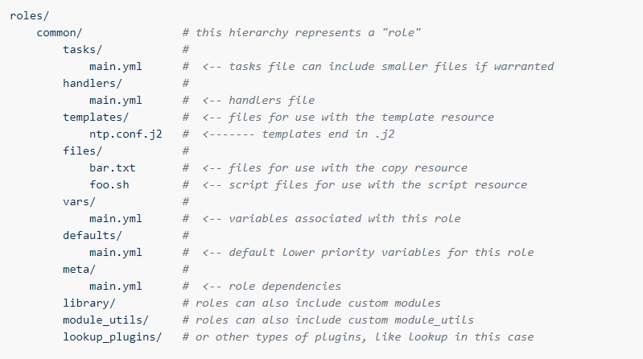
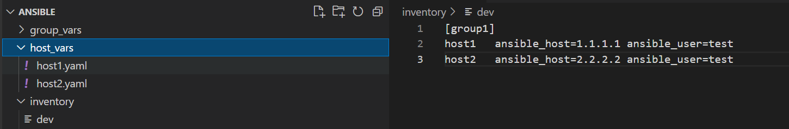
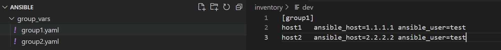
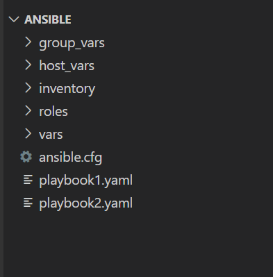

### Understand *inventory*

By default we maintain inventory in **hosts** file, and it's path controlled by ansible.cfg file. But this is not suitable if you have multiple environment. Also it is sometimes dangerous as you have mentioned all your servers in one file, and executed some wrong task. Here are two problems
- You have all servers in one file.
- Due to default inventory file, playbook will pick up inventory file automatically, no need to mention inventory file explicitely.

But if you use directory sturcture shown in below image, will help to solve above issue.

In above image, we have created seperate directory called **inventory** and inside that we have created files with environment name like **dev** for development environment and **prod** for production environment. Obiviously, we will mention all development environment servers in **dev** file and production environment servers in **prod** file under **inventory** directory.

As this is customized location for inventory, it won't get considered while running playbook. You need to pass parameter explicitely like **-i inventory/dev**

**Note** - *Ansible suggest to create inventory file in ROOT directory with environment name, but it's my thought that if we create a directory sepereately it would be much better.*

### Understand *role*

ROLE is nothing but a bunch of task which will help to achieve specific goal. It is a same concept what **functions** do in programming. Provide resuability and flexibility at the same time reduce complication, and also portable and sharable. 

Let's take example to understand better.

In previous session, we have written a playbook to install apache, in that we have written 8 task.
Now that playbook is not much flexible and most of values are hard coded. But we can convert same playbook in ROLE to achieve same goal, install apache.

ROLE follow specific directory structure, which make it more flexible, resuable, portable. Below directory structure you will find inside ROLE.

By default, Ansible looks for roles in the following locations:
- in collections, if you are using them
- in a directory called roles/, relative to the playbook file
- in the configured roles_path. The default search path is ~/.ansible/roles:/usr/share/ansible/roles:/etc/ansible/roles.
- in the directory where the playbook file is located

For more information you can refer https://docs.ansible.com/ansible/latest/user_guide/playbooks_reuse_roles.html

------

### Understand *host_vars* direcotry structure

**host_vars** directory is a place where you can define variable for each host. Mostly it is a prefered location to define a variable which is a unique per server, but you can define a other variables also which that host are going to refer, but then it will be repeatative task. 

For example, in above image, suppose we have two mysql servers called **host1** and **host2**. Now suppose **host1** is a **writer** node and **host2** is a **reader** node. we want to define a variable called **ROLE** which will identify which server is **WRITER** and which server is **READER**. In this case both server are identical, but one of the property have different value on the basis of host. So such type of variable we can define inside **host_vars** directory. Just make sure you need to create a file under **host_vars** directory with same host name what you have in inventory file, in our case it would be **host1.yaml** and **host2.yaml**

Now let's take another variable, i.e. mysql_version=5.7 This variable will be reffered while installing mysql package on both servers (**host1** and **host2**), so I can define this under **host_vars**, but need to define in both files **host1.yaml** for *host1* and **host2.yaml** for *host2*, which is a repeatative task, and in case in future, version get changed, I need to update vesion in both file. It is fine if we need to make changes in 2 files, but just imaging if there are 500 servers, it means there would be 500 files and you need to make changes in 500 files.

**Note** - *You need to create a file with same host name what you have created in inventory.*

For more information you can refer https://docs.ansible.com/ansible/latest/user_guide/intro_inventory.html

------

### Understand *group_vars* direcotry stucture

**group_vars** directory provide us flexibility to define a variable which can be used by multiple servers. Instead of defining variable for each host, which will be repeatative task, we can define it inside **group_vars**. 

In above image you can see, in inventory I have a group called **group1** which have 2 servers, named **host1** and **host2**. Now by continuing example given in hosts_vars section about mysql_version variable, we can define it under **group_vars** with file called **group1.yaml**.

**Note** - *You need to create a file with same group name what you have created in inventory.*

For more information you can refer https://docs.ansible.com/ansible/latest/user_guide/intro_inventory.html

------

#### Directory Structure in Ansible

We follow some systamatic process, when things we want to perform perfectly everytime. Ansible also have it's own directory structure which is recommonded. These directory structure help us to reduce complication and help to handle big infrastructure with ease.

Observe below directory structure.

In above image, **ANSIBLE** is a root directory where you can find *ansible.cfg*. It is ansible standard that wherever *ansible.cfg* is, from that location only you can play ansible-playbook or ansible command.

We already seen ***group_vars*, *host_vars*, *inventory*, *roles*** directory structure, but all those directory should be under **ROOT** directory.

All playbooks should be under **ROOT** directory. You can find **vars** directory where we can keep extra variable files which can be refered inside playbooks.

For more information you can refer https://docs.ansible.com/ansible/2.8/user_guide/playbooks_best_practices.html

### Understand VARIABLE and it's precedence

Till now you already figure out that there are multiple location where you can define variables, i.e *group_vars, host_vars, vars directory inside ROOT directory, vars directory inside ROLE, default directory inside ROLE* etc....

There are total 22 locations where you can define variable. So there is lot more possibility that one variable defined at multiple locations with different value, in such situcation variable precedence come into picture.

But if you maintained some standard to defined variable then you won't face such issues.

For more information you can refer https://docs.ansible.com/ansible/latest/user_guide/playbooks_variables.html#variable-precedence-where-should-i-put-a-variable

------
Back to [LearnANSIBLE](../Readme.md)

Go to [Lab-5](../Lab-5/Readme.md)