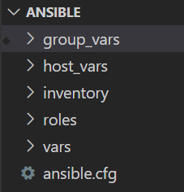

## Create proper ansible code

In last session we have seen directory structure for ansible. In this section we will implement that. We already saw simple playbook to install and configure apache webserver, same thing we are going to implement but this time with proper directory structure.

- Create 3 ec2 instance with [ansible-userdata](../../userdata-scripts/ansible-userdata.sh)
- Name them as web-1, web-2 and web-3.
- Create password-less login between ansible server and these 3 ec2.
- Clone **infra-config** repo.
- Create below directory structure inside **ansible** directory. Delete hosts file.

- Create **dev** inventory file inside **inventory** directory.
- Create **webserver** group, have 3 webserver's named, **web-1, web-2 and web-3**. Maintain same sequence what you have given in **Name tag for ec2**.
- Create role called **APACHE**

        cd infra-config/ansible/roles
        ansible-galaxy init APACHE

- Write task to install apache package.

        ---
        # defaults file for APACHE
        - name: "Install require packages"
        yum: 
            name: "{{ PACKAGES }}"
            state: latest  

- Define **PACKAGES** variable inside role **APACHE/var/main.yaml** 

        PACKAGES: 
        - httpd
        - php

As suggested, whenever you are writing new playbook, never write all tasks in one go. Write one task, run playbook, once it succeed go for next.

Let's write a playbook which will call this APACHE role.

- Write a playbook **webserver.yaml** in ROOT directory.

        ---
        - name: "Install and configure apache"
        hosts: "{{ HOSTS }}"
        become: yes
        roles:
        - role: APACHE

- Run a playbook from ROOT directory.

        ansible-playbook -e HOSTS=web-1 -i inventory=inventory/dev webserver.yaml

**Note** :
    
1. HOSTS variable is not defined anywhere for safety reason. We are forcing to provide it while running a playbook. This will help to avoid to run a playbook against wrong server.

2. We are not using hosts file for inventory which is default one. Due to which we need to explicitely mention which inventory file need to refer. This practice again will save us from running playbook accidently on wrong environment.

Write below tasks inside **APACHE** role.
- Take a backup of original **httpd.conf** file.
- Copy our **httpd.conf** file inside web server. Restart apache if any change in file.
- Create document root directory.
- Copy **index.html** file. Restart apache if any change in file.

Once you complete all tasks successfully. You can hit public ip address of each webserver, you should see something like this.

for Web-1

        This is DEV environment and request served from web-1 for MeriMarji Pvt. Ltd..

for Web-2

        This is DEV environment and request served from web-2 for MeriMarji Pvt. Ltd..

for Web-3

        This is DEV environment and request served from web-3 for MeriMarji Pvt. Ltd..        
You can refer full APACHE role [here](./Lab/roles/APACHE/)

------

Back to [LearnANSIBLE](../Readme.md)

Go to [Lab-6](../Lab-6/Readme.md)