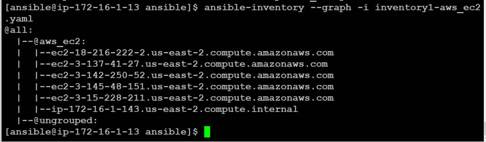
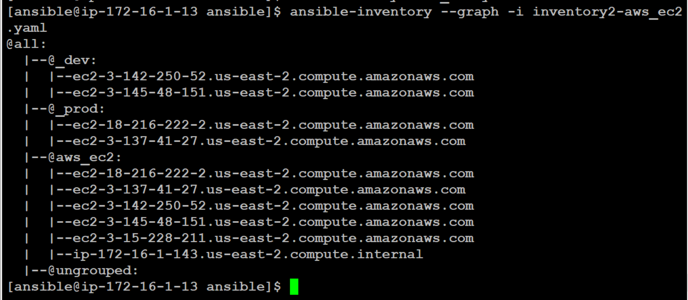

## Ansible Vault

Ansible Vault is a feature of ansible that allows you to keep sensitive data such as passwords or keys in encrypted files, rather than as plaintext in playbooks or roles. These vault files can then be distributed or placed in source control.

Ansible use **AES** (which is shared-secret based) as default cipher to encrypt data.

#### Create new file with encryption

    ansible-vault create dbpass.yml

#### Edit encrypted file

    ansible-vault edit dbpass.yaml

#### Create new file with encryption using vault id

    ansible-vault create --vault-id frontend@prompt dbpass.yaml

#### Edit encrypted file using vault id

    ansible-vault edit --vault-id frontend@prompt dbpass.yaml

#### Change valut password
**with vault id**

        ansible-vault rekey --vault-id frontend@prompt dbpass.yaml

**without valut id**

        ansible-vault rekey dbpass.yaml

#### Encrypt existing unencrypted files
**with vault id**

        ansible-vault encrypt --vault-id frontend@prompt dbpass.yaml

**without valut id**

        ansible-vault encrypt dbpass.yaml

#### Decrypt encrypted files
**with vault id**

        ansible-vault decrypt --vault-id frontend@prompt dbpass.yaml

**without valut id**

        ansible-vault decrypt dbpass.yaml

#### View encrypted file
**with vault id**

        ansible-vault view --vault-id frontend@prompt dbpass.yaml

**without valut id**

        ansible-vault view dbpass.yaml
------

#### Lets apply ansible vault practically.

- **ansible vault using *--ask-vault-pass* parameter**

Create a simple playbook to add linux user. But it's password should be store in a var file in encrypted format.

Refer below files.

[createuser.yaml](./Lab/createuser.yaml)

[user-var.yaml](./Lab/user-var.yaml)

[secret.yaml](./Lab/secret.yaml)

Below command will encrypt file which has password.

        ansible-vault encrypt secret.yaml

Below command will ask vault password, and after providing password, playbook will run.

        ansible-playbook -i inventory/dev -e HOSTS=web-1 --ask-vault-pass createuser.yaml

Try to login with user on remote server with same password which we have given in secret.yaml.

But now question will come to mind that do we need to remember vault password. For this ansible provide solution to store password in a file.

- **ansible vault using *password file***

Instead of providing **--ask-vault-pass** parameter while playing a playbook, we can configure ansible to refer a file where vault password is stored.

Add below line in **ansible.cfg** in **defaults section**.

        vault_password_file = vaultpass

Create **vaultpass** file in ROOT directory and mention vault password in that file and run playbook without **--ask-vault-pass** parameter.

        ansible-playbook -i inventory/dev -e HOSTS=web-1 createuser.yaml

Try to login with user on remote server with same password which we have given in secret.yaml.

------

## Use of AWS-SSM with ansible for secrets
We have another alternative to store secrets or password provided by Cloud Technology. In case of AWS, **SSM service** have **paramter store** option where we can save secrets or password which are sensative, and those can be called in ansible playbook.

We will use same playbook used in previous exmaple. Create a copy of that playbook named as **createuser-ssm.yaml** and make only below change also **remove secret.yaml** from vars_files section.

      command : perl -e 'print crypt($ARGV[0], "{{  lookup('aws_ssm', 'otpsender-password', region="us-east-2" ) }}")' {{ appuser }}

Now, create **otpsender-password** parameter in parameter-store option in SSM service.

Now run playbook

        ansible-playbook -i inventory/dev -e HOSTS=web-1 createuser-ssm.yaml

Try to login with user on remote server with same password which we have given in secret.yaml.

------

## Dynamic inventory

Ansible provides a way to have dynamic inventory. We can use cloud specific plugin to fetch inventory from cloud provider.

Let's try dynamic inventory. Spin 4 instance's and give below tags to them.

- Server-1

        Name : webserver
        env : dev

- Server-2

        Name : webserver
        env : prod

- Server-3

        Name : database
        env : dev

- Server-4

        Name : database
        env : prod

Create **inventory-aws_ec2.yaml** file. Refer [inventory1-aws_ec2.yaml](./Lab/inventory1-aws_ec2.yaml)

You need to install boto3 python module and it require pip command.

        yum install pip
        pip install boto3

You also need to configure aws access and secret key for authentication. 

Refer [create-aim-user](../../PrepareSystem/create-iam-user.md) to create IAM user.

Refer [aws-configure](../../PrepareSystem/install-aws-cli.md) to configure access/secret key.

Execute below commnd to see what this inventory file has.

        ansible-inventory --graph -i inventory1-aws_ec2.yml

You can create filter servers on the basis of tags. We have 4 servers, 2 servers in **dev** environment and 2 servers in **prod** servers. Lets create group on the basis of tag **env**.

Create **inventory2-aws_ec2.yaml** file. Refer [inventory2-aws_ec2.yaml](./Lab/inventory2-aws_ec2.yaml)

Execute below commnd to see what this inventory file has.

        ansible-inventory --graph -i inventory2-aws_ec2.yml

------

Back to [LearnANSIBLE](../Readme.md)