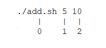

## Functions in bash script

Scripting or programming without functions can not imagine. Function in scripting help to reuse block of code. Sometimes while developing a script/program/application, we come across a block of code which get repeated N number of times without any change. There is no problem to copy paste code N number of times, but 
- It increases number of lines, which turns into more complications and confusion for new person who is looking at code.
- It become more problematic if you want to make changes in that particular block of code. You need to make changes wherever that block of code got repeated.
- Your application size get bigger which eventually consume more memory and reduce performance.

All of the above issues can be fixed by using functions in the code.

Let's understand syntax of function in bash script.

    add() {
        // block of code
    }

By looking at above syntax, we can say
- Function start with "function name" followed by open and close round brancket and then open curly braces, in above example **add() {**
- Function over with the close curly braces **}** and between open and close curly braces we can write our code.

But defining a function is not everything, it won't do anything. Let's try it.

Create **add.sh** and define a function which will add two number.

    #!/bin/bash
    add() {
        output=`expr $1 + $2`
        echo $output
    }

#### $1 and $2 are referred as positional parameter. We are going to learn that in some time.

Now if you run above code it won't print anything. Because we have just defined function. To get output of a function or to execute a function we need to call it. We can call function like this...

    add 5 10

Add above line in your code, so your script will look like this...

    #!/bin/bash
    add() {
        output=`expr $1 + $2`
        echo $output
    }

    add 5 10

Now understand what exactly happen. In a function we used 2 **positional parameter**, $1 and $2. And while calling function we passed 2 values, 5 and 10. In scripting/programming when you run a script, by default it assign a position number to each element. Script name position will always be zero (0) and then next element will have 1 position and so on and so forth. We use below command to execute this script.

   

It means if I use $0 it should print script name. Let's try that.

    #!/bin/bash
    add() {
        output=`expr $1 + $2`
        echo $output
        echo $0
    }

    add 5 10

Wow ! Great !! Amazing !!! Isn't it !!!!

Now lets write a script which will 
- Ask user to type name of shape and provide 3 option like **"Enter name of a shape [Type 1 for Circle, Type 2 for Rectangle, Type 3 for square] : "**.
- It should not accept other than above 3 shapes.
- if given other input, give message that it will only accept shape from given option only and then again ask user to type name of shape.
- Once script get name of shape, ask required info to calculate it's area.
- If user press 'q' or 'Q', program should exit.

Check [calc_area.sh](./calc_area.sh)

-----

back to [LearnBASH](../../LearnBASH/Readme.md)

go to [Lab-7](../Lab-7/Readme.md)