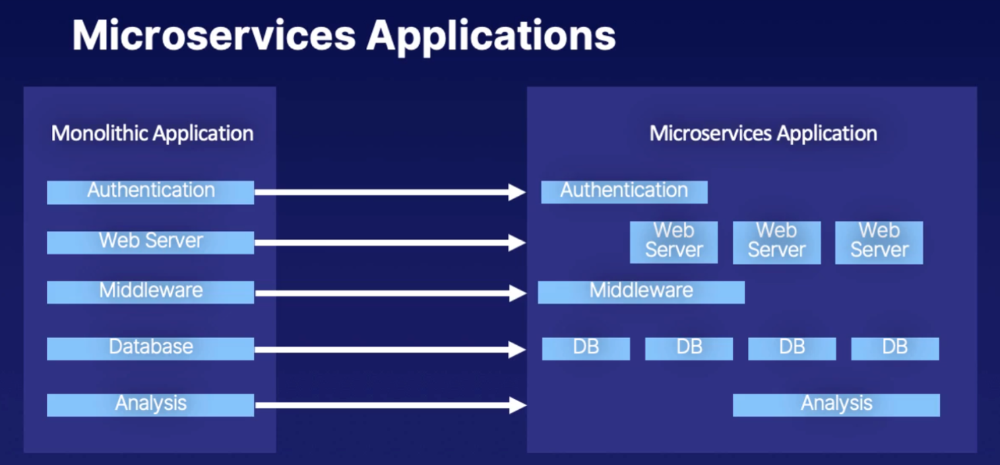
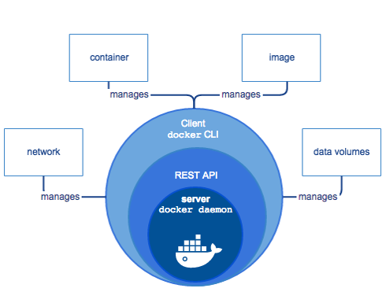
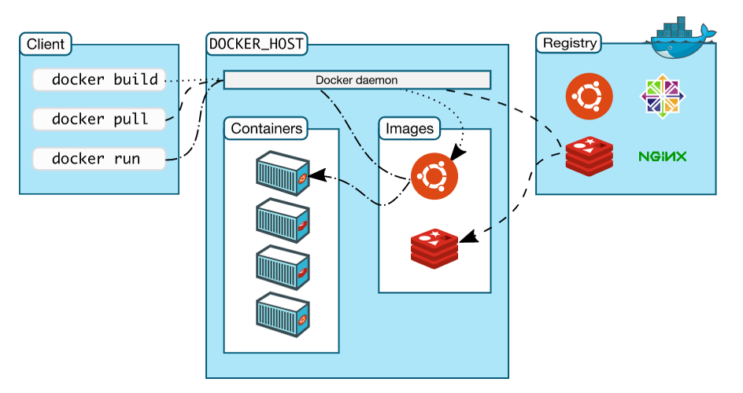

## Why Docker

Docker is known for platform for the microservices. To understand why Docker or any other microservice platform is important now a days, first we need to understand what is microservices and Monolithic application.

### Monolithic applications
If all the functionalities of a project exist in a single codebase, then that application is known as a monolithic application. We all must have designed a monolithic application in our lives in which we were given a problem statement and were asked to design a system with various functionalities. We design our application in various layers like presentation, service, and persistence and then deploy that codebase as a single jar/war file. This is nothing but a monolithic application, where “mono” represents the single codebase containing all the required functionalities. 

### Microservices 

It is an architectural development style in which the application is made up of smaller services that handle a small portion of the functionality and data by communicating with each other directly using lightweight protocols like HTTP. According to Sam Newman, “Microservices are the small services that work together.” 

## What is DOCKER

Docker is a set of platform as a service products that uses OS-level virtualization to deliver software in packages called containers. Containers are isolated from one another and bundle their own software, libraries and configuration files; they can communicate with each other through well-defined channels.

## Docker Engine

Docker engine is nothing but a simple process who create virtualization / isolation to run application. Docker is natively developed for Unix based system, but we can install docker in windows based systme also, but along with that you need to install application for virtualization which will help docker engine for virtualization.

## Docker architecture

In above image, you can see docker daemon is running as a process. Outside of that there is rest api layer, and outside of that there is docker CLI commands which will call rest api's to communicate with docker daemon.

Along with that, 4 main component given in above image. But there are other components also, but these are the 4 main component which we will study in detail.

- Image
    Docker uses images to run containers. These image nothing but a dump of required libraries to the application and application itself.

- Container
    When we run a image, it become a container. Just imagine, image just like a dead human body, and container is a human body with soul.

- Data volume
    You can create chunks of attached hard disk and can allot to a container as a storage, just like we do with NAS/SAN solution.

- Network
    Docker deamon creates it's own network, and containers uses that network. Docker network provides in-build DNS service which is very helpful to communication between two containers. 

## Docker vs Virtualization

Docker containers and virtual machines are both ways of deploying applications inside environments that are isolated from the underlying hardware.

With a container runtime like Docker, your application is sandboxed inside of the isolation features that a container provides, but still shares the same kernel as other containers on the same host. In contrast, with a virtual machine, everything running inside the VM is independent of the host operating system, or hypervisor.

------

Back to [LearnDOCKER](../Readme.md)

Go to [Lab-2](../Lab-2/Readme.md)