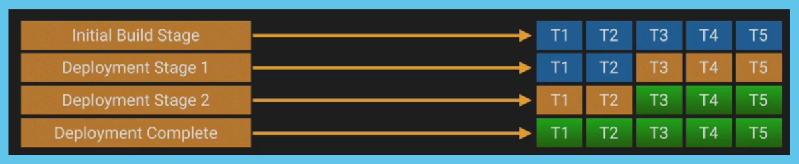
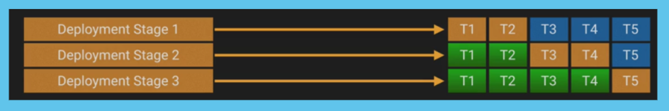
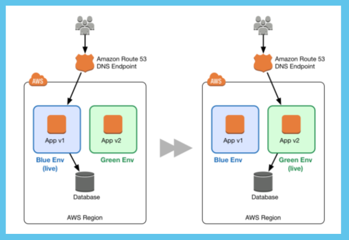
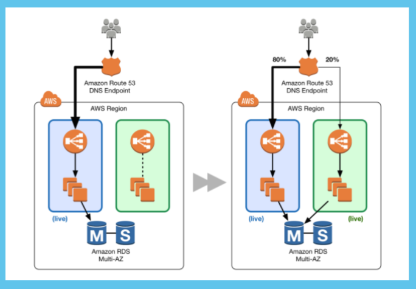

## Deployment types

Because of changes in software development, if also impacts on their releases. In microservices we saw, each component of application is independent and can be release as and when required. Because of this there are changes in way we deploy applications in real environment.

Below are major deployment types which you can find in real projects.

### Minimum In-Service deployment

With this method, we specify the minimum number of instances in our applications that stay in-service while updating the remaining percentage—therefore, deploying to as large a number of targets as possible. This process is repeated until all servers have been updated with the new release.

Example: If we have 5 containers each running our current application A, then we set our policy to keep a minimum in-service number of 2. We take 3 servers offline to update them to our new version B. Once these are completed and back online, we can update the remaining 2.

- Disadvantages
    - The process happens in multiple stages, so support is necessary in the form of orchestration and health checks outside of Swarm
    - Does not work well for infrastructure changes
    - Changes are being run on live servers—recovery time may be necessary if one fails

- Advantages
    - There are few moving parts, which means increased testing capability; make application and code changes within the process
    - No downtime and no additional infrastructure cost
    - The process is often quicker than a rolling deployment

#### Rolling Deployments

Consider rolling deployments as an extension of minimum in-service. However, rather than define the number of containers that should remain online, we specify the maximum number of containers to update in tandem.

Example: We have the same 5 containers as before, but this time we initialize rolling updates by specifying the number of containers that may be updated simultaneously, e.g. 2. The process moves updates through 2 containers at a time until all the servers in the series are updated.

- Disadvantages
    - Docker rolling updates deal with failure in two ways:
    - By pausing, allowing someone to jump in and rollback to fix
    - Or continuing regardless, meaning you may not discover a problem while the container is running
    - More complex than minimum in-service
    - Can be the least efficient in terms of deployment time; based on the time taken to update per stage
    - Again, we recommend orchestration and health checks outside of Swarm

- Advantages
    - No downtime
    - Pausing is possible, permitting limited multi-version testing
    - Allows for automated testing—to assess deployment targets before continuing

### Blue/Green Deployments

When following the Blue/Green (a.k.a. Red/Black) method, we replicate our “entire” infrastructure for a short time. The replicated infrastructure hosts the new application, while the old infrastructure continues to run until testing is complete and the new stack is adopted. The capabilities to achieve this have been around for a long time, but before the Cloud, it was an incredibly costly deployment method. Now, we can deploy stacks to a whole new environment—allowing for isolated evaluation—and thanks to the Cloud, at minimal costs. Once testing is complete, we switch our application over to the new version and shut down the legacy stack.

As the image depicts, Blue represents your current environment version, while the new variant you want to deploy is Green. Typically, this happens in the form of a DNS change, though you can deploy Blue/Green by modifying Auto Scaling Groups too.

- Disadvantages
    - Requires advanced orchestration tooling
    - Some risk as the same database is necessary
    - Incurs some additional cost, though for a short time only
    - Unnatural user traffic will flood your servers—which is not the point for everything to break

- Advantages
    - Reduced risk profile since infrastructure becomes immutable
    - Offers near zero-downtime
    - The switch is clean and controlled when using a DNS change
    - Process is fully automated and provides a larger validation window
    - It’s possible to test the entire environment’s health and performance before the switch

### A/B Testing

A/B deployments are virtually identical to Blue/Green, but in this method, we send a small percentage of traffic to our new green environment. This method is capable of switching environments and changing infrastructure, but in a far more precise way than with Blue/Green deployment.

Selecting your method of deployment comes down to what best suits your business and technical needs. If it makes sense for your application and user base, it is highly recommend leveraging A/B testing where possible. 

- Disadvantages
    - In comparison to the aforementioned deployment methods, there are a lot of moving parts
    - Much more complex
    - Requires full automation of everything

- Advantages
    - All the benefits of Blue/Green deployments, plus:
    - We can predictably scale capacity and pre-warm production
    - Use to test new features and make gradual assessments on performance, stability, and health
    - We gain customer validation while mitigating blast impact and widespread errors

------

Back to [LearnDOCKER](../Readme.md)