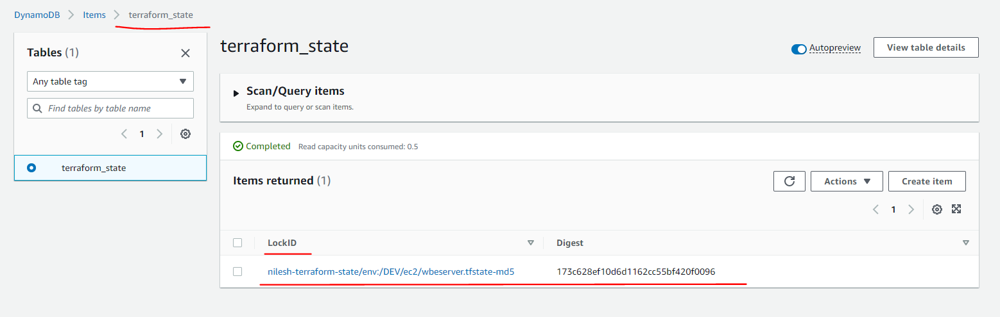

## State file in Terraform

Terraform must store state about your managed infrastructure and configuration. This state is used by Terraform to map real world resources to your configuration, keep track of metadata, and to improve performance for large infrastructures.

This state is stored by default in a local file named "terraform.tfstate", but it can also be stored remotely, which works better in a team environment.

Terraform uses this local state to create plans and make changes to your infrastructure. Prior to any operation, Terraform does a refresh to update the state with the real infrastructure.

The primary purpose of Terraform state is to store bindings between objects in a remote system and resource instances declared in your configuration. When Terraform creates a remote object in response to a change of configuration, it will record the identity of that remote object against a particular resource instance, and then potentially update or delete that object in response to future configuration changes.

Below are some commands we can use with state file.

Let's checkout some commands.

#### We can list out resources created by terraform code by querying state file.

    terraform state list

#### We can checkout detail of specific resource created by terraform code.

    terraform state show data.aws_security_group.dev-sg

#### We can pull current status of resource in state file.
This command usefull, if anybody modifed resource manually after creating it with terraform, so whatever changes done manually we need to pull it into state file. And then eventually you need to sync your terraform code also. Let's see practical example.

- Create webserver ec2 with our terraform code.

- Check state file.

        terraform state list

- Now go to aws console, and change Name tag manually. Add **-Apache** word, as shown below.

- Lets pull the resource detail to update state file.

        terraform state pull

- Execute terraform plan to check changes.

        terraform plan

Above output shows that state file is updated, but in terraform code still old tag is mentioned due to which if we apply code, it will revert back.

- To sync our terraform code, we can make changes in **Name** tag (ec2name variable) in web.tf. Refer [web.tf](./ec2/webserver/web.tf)

- Now if you execute terraform plan, it won't show any change.

#### Remove created ec2 from state file.

    terraform state list
    terraform state rm module.webserver[0].aws_instance.ec2instance
    terraform state list

Here one point need to note down, we have removed ec2 from state file, but that ec2 still running on cloud platform. Now that ec2 is not managed by Terraform anymore. If we want to terminate it, we need to termiate it manually.

------

For more information on terraform state command refer https://www.terraform.io/language/state

------

## Workspace in Terraform
Workspace is nothing but a place where work has been done. By default Terraform create **default** workspace and it can not be deleted.

    terraform workspace list

But in real world we need to deal with multiple environment, which has it's own requirement. In such situation **default** workspace won't be enough. To come over this situation we can create new workspace for each environment which is very easy solution.

    terraform workspace new dev

Above command will create workspace called as **dev**. 

Below are some command related to workspace.

- List workspace

        terraform workspace list

- Show current workspace

        terraform workspace show

- Switch/select particular workspace

        terraform workspace select <workspace-name>

- Create new workspace

        terrafmr workspace new <workspace-name>

- Delete workspace

        terraform workspace delete <workspace-name>

*Terraform also provide default variable to call this workspace that is **terraform.workspace***

Let's see how we can use workspace in real world.

- Create 2 workspace called **DEV** and **PROD**
- Use code created in Lab-4.
- Replace their values with variable, using lookup function, refer workspace.
- In variable.tf file, mention value as per the workspace.

Refer [web.tf](./ec2/webserver/web.tf)

Refer [variable.tf](./ec2/webserver/variable.tf)

Refer [complete code here](../Lab-5/)

------

## Remote Backend in Terraform
We just saw how workspace work, but what if code is used by multiple people from multiple devices. By default, Terraform uses a backend called local, which stores state as a local file on disk. It would be difficult to track changes as state file will get created on each system, and changes made by one team member will not refelect on another team members system, and then state file would be stale file.

To overcome this issue, terraform support remote backend system which can helpful in this situation.

To configure remote backend, we need to use **backend** block inside **terraform** block.

Let's configure S3 as a remote backend in our example.

        terraform {
                backend "s3" {
                bucket = "terraform-state"
                key    = "ec2/wbeserver.tfstate"
                region = "us-west-1"
                dynamodb_table = "terraform_state"
                }
        }

Above configuration will help to configure terraform to use S3 as a backend. Offcourse we need to create S3 buckte and dynamodb table as mentioned in configuration.

- Create S3 bucket named **terraform-state**
- Create dynamodb table named **terraform_state**
- Give primary key as **LockID**

Here we are doing 2 things, We are using S3 as remote backend as well as using dynamodb table for locking purpose. It means S3 bucket will have state file, and dynamodb table will have lock id, if that mismatched, terraform code won't get executed, user will get locked. This is more important from security prospective.

Copy above **backend** block in terraform.tf file inside **terraform** block. **terraform.tf** file should look like this

    terraform {
    required_version = "1.2.5"
      backend "s3" {
      bucket = "nilesh-terraform-state"
      key    = "ec2/wbeserver.tfstate"
      region = "us-east-2"
      dynamodb_table = "terraform_state"
      }    
    }

You need initialize terraform to activate new backend. 

    terraform init

Check output, it will point backend to S3. Now onward, whatever changes done in state file, it would get synced to S3 bucket. So if any team member started to work on terraform code on his system, he will do initialization and he will receive udpated state file from S3.

Let's apply terraform configuration, so that state file will get created on s3 and md5 entry in dynamodb table.

        terraform plan
        terraform apply

State file and md5 entry will get created in S3 and dynamodb respectivaly after terraform apply.

------

For more information on backend in Terraform refer **https://www.terraform.io/language/settings/backends/remote**

------

Back to [LearnTerraform](../Readme.md)

Go to [Lab-6](../Lab-6/Readme.md)