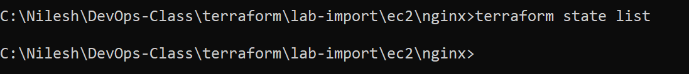
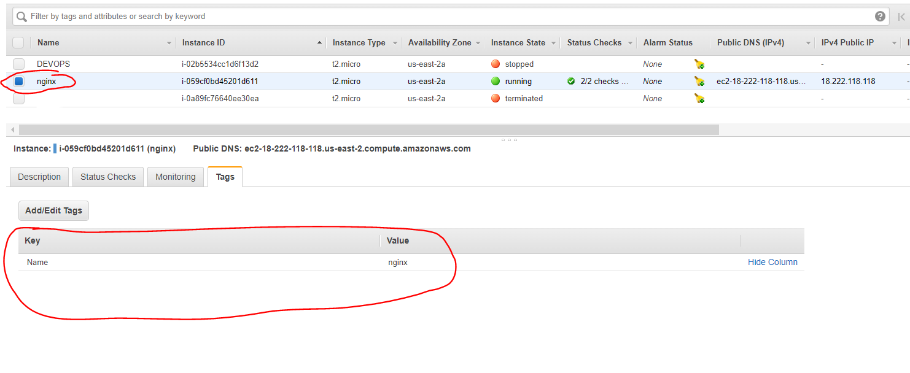
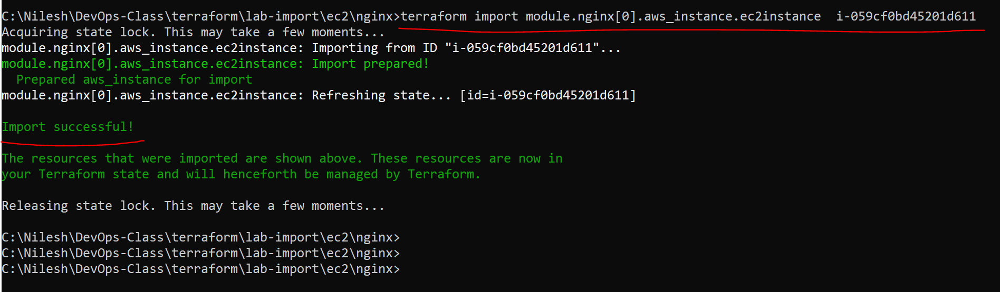
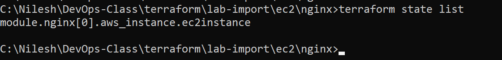
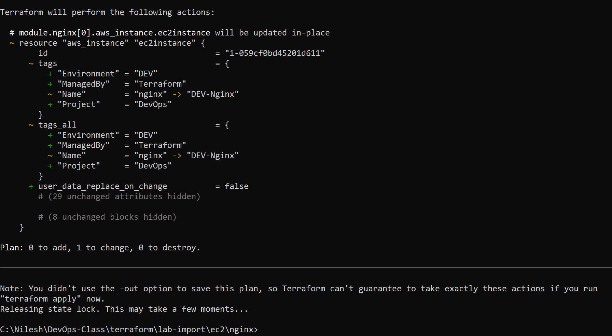
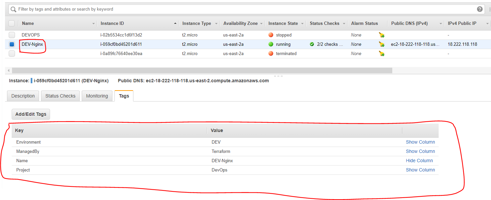

## Import resource in Terraform

Import resources in Terraform is one of the first activity sometimes you need to do when your organisation decided to use terraform if they are not using. Import resources means you have already running servers or created resources which is not created by Terraform code, but now you need to manage those resources by Terraform. In such situation you need to create terraform configuration code and then need to import resource.

**Note** - *The current implementation of Terraform import can only import resources into the state. It does not generate configuration. A future version of Terraform will also generate configuration.*

As you know, when you create resource by Terraform, its detail maintained in state file. So when you import a resource, it write down detail of imported resource in state file. But before importing you need to create terraform code for the said resource.

Let's do it practically to understand better.

- Create ec2 and give name as **nginx**

- Cross verify tags for created instance id.

- To create a terraform code for this resource, we will just create replica of webserver directory which is under ec2 directory. (Of course only **.tf** files) Refer directory [nginx](./ec2/nginx/)

- Now if you run **terraform plan** command, it will show 1 new resource to create obviously. You can try that and check.

- Now just check state file to check what resources already there.

        terraform state list

- Now let's import resource with below command.

        terraform import module.nginx[0].aws_instance.ec2instance  i-059cf0bd45201d611

- Once again check state file.

        terraform state list

- Cross verify tag, no any change after import. Because in import whatever original detail resource have only those get write down in state file.

- Now execute terraform plan again. This time it will say change for resource. Go for terraform apply and accept the change.

        terraform init
        terraform plan

        terraform apply

Note - We have mentioned tags and it's value in terraform code, due to which now it is showing that there is a change.

- After applying, check tags for ec2, it get changed.

------

For more information on importing a resource in Terraform refer https://www.terraform.io/cli/import

------

Back to [LearnTerraform](../Readme.md)